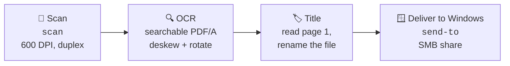
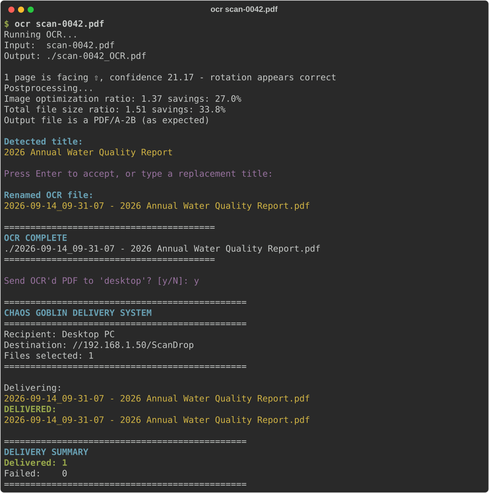

<p align="center">
  
</p>

<h1 align="center">Chaos Goblin Delivery System</h1>

**Scan it, read it, name it, ship it.** A small set of Linux command-line tools that turn paper (or an existing PDF) into a searchable, sensibly named PDF and drop it straight into a shared folder on a Windows PC, in one command.



## Install

```bash
git clone https://github.com/mhoal11/chaos-goblin-delivery.git && cd chaos-goblin-delivery && ./install.sh
```

The installer puts the commands in `~/.local/bin` (no sudo) and creates starter settings in `~/.config/chaos-goblin/`. It never overwrites settings you've already edited, and it lists any missing tools.

**Requirements:** Linux with `bash`, `python3`, `smbclient`, `ocrmypdf`, `pdftotext` (poppler-utils), `img2pdf`, `scanimage` (sane-utils) and `zenity`. On Debian, Ubuntu or Parrot:

```bash
sudo apt install smbclient ocrmypdf poppler-utils img2pdf sane-utils zenity
```

## Set up a recipient

A **recipient** is a shared folder on a Windows PC.

**First, set up the Windows side:** a drop account, a shared folder and a firewall rule. Step-by-step PowerShell is in **[docs/WINDOWS_SETUP.md](docs/WINDOWS_SETUP.md)** (about 5 minutes).

Then, on Linux, each recipient is a small profile file:

```bash
# ~/.config/chaos-goblin/recipients/desktop.conf
DISPLAY_NAME="My Windows PC"
SMB_HOST="192.168.x.x"          # the PC's local IP address or hostname
SMB_SHARE="ShareName"           # the shared folder's name
CREDENTIALS="$HOME/.smbcredentials"
```

Create the credentials file from [`config/smbcredentials.example`](config/smbcredentials.example) and lock it down:

```bash
chmod 600 ~/.smbcredentials
```

Add as many recipients as you like (`laptop.conf`, `office.conf`…). The one used by `scan` and `ocr` is set by `DEFAULT_RECIPIENT` in `~/.config/chaos-goblin/chaos-goblin.conf`.

## Commands

| Command | What it does |
|---|---|
| `scan` | Scans from the document feeder (single-sided), makes a searchable PDF/A, saves it to `~/Documents/Scans`, then asks whether to send it. |
| `scan double` | Same, double-sided. |
| `ocr file.pdf` | Makes an existing PDF searchable (straightens and rotates pages), detects its title, renames it `date - Title.pdf`, then asks whether to send it. |
| `send-to desktop file.pdf more.jpg` | Sends one or more files to a recipient. |
| `send-to desktop` | Opens a file picker, then sends whatever you choose. |

Want a one-word shortcut? Add an alias to `~/.bashrc`:

```bash
alias ToDesktop='send-to desktop'
```

## See it work

A fictional sample report (included as [`examples/sample-report.pdf`](examples/sample-report.pdf), an image-only "scan" with no text layer):


Running `ocr` on it makes it searchable, finds the title, renames the file, and delivers it:



*Demo run against a test recipient. All companies, names and addresses are invented.*

The other samples in [`examples/`](examples/) are detected like this:

| Sample | Detected title |
|---|---|
| `sample-report.pdf` | 2026 Annual Water Quality Report |
| `sample-invoice.pdf` | INVOICE |
| `sample-notice.pdf` | HOMEOWNERS POLICY RENEWAL NOTICE |

## How the title detection works

[`lib/detect-pdf-title`](lib/detect-pdf-title) reads where every line of text sits on page 1 and how big it is, then:

1. **Skips page furniture:** addresses, phone numbers, emails, websites, dates, page numbers, greetings and reference lines like *Invoice No.*
2. **Repairs OCR splits:** joins broken words like `STATE MENT` → `STATEMENT` when the result is a known document word.
3. **Joins wrapped titles:** a heading that continues onto the next line in the same size is read as one title.
4. **Scores each heading and picks the best:** larger text, document-type words (*Invoice, Report, Agreement, Notice, Statement, Receipt…*), ALL-CAPS or Title Case, centered, near the top, and a sensible length all add points.

The chosen title is cleaned of characters Windows doesn't allow in filenames (`\ / : * ? " < > |`), trimmed to 90 characters, and prefixed with the original file's date so files sort in order. You can always type your own title at the prompt instead.

**Teach it your own document types:** add one word per line to `~/.config/chaos-goblin/title-words.txt` (for example `PRESCRIPTION`, `ITINERARY`, `SYLLABUS`), and headings containing those words will be favored.

## Delivery details

- Uses `smbclient`, so no network drive has to be mounted.
- File names with spaces, quotes and backslashes are escaped safely.
- Prints a delivery summary and shows a desktop notification (`notify-send`) when it finishes.
- Exits non-zero if any file fails, so it works inside other scripts.

## Hardware

Built and tested with an **Epson ES-400II** using the SANE `epsonds` backend; `scan` finds it automatically over USB. For any other SANE scanner, set `SCANNER` in `~/.config/chaos-goblin/chaos-goblin.conf` (find the name with `scanimage -L`). Scan settings are 600 DPI, US Letter.

## License

[MIT](LICENSE) © 2026 Jenny Pena
